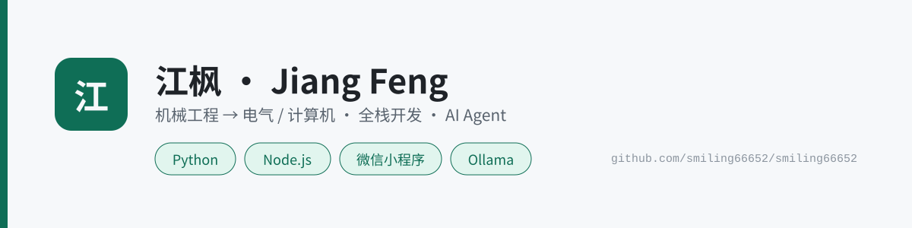

<!--
  GitHub 个人主页 README
  用法：新建仓库 smiling66652/smiling66652（Public）→ 勾选 Add a README file → 把本文件内容粘进去覆盖
  组件选择依据：全部经 2026-09-15 实测，只用在大陆可达的（详见 _research/06-主页美化调研.md）
  ⚠️ 已刻意排除：github-readme-stats / trophy / capsule-render / activity-graph —— 官方实例是 *.vercel.app，大陆打不开会破图
-->

  <picture>
    <source media="(prefers-color-scheme: dark)" srcset="assets/banner-dark.svg">
    
  </picture>

  <b>机械工程本科 → 转电气 / 计算机方向</b> 
  全栈开发 · Python 自动化 · AI Agent 工程 · 微信小程序

  
  
  

---

## 关于我

合肥工业大学机械工程学院在读，机械工程专业，**方向转向电气 / 计算机**。

做的东西横跨三层：**底层抓数据 → 中间做工程 → 上层接 AI**。
具体来说，我用 Python 与 Node 写自动化与爬虫，用微信小程序 + 腾讯云 CloudBase 做端到端应用，
把本地大模型（Ollama / LM Studio）与云端 API 混着用，并把我日常用的 AI 助手能力沉淀成**可复用的技能库**。

> 我倾向于把「踩过的坑」沉淀成可执行的东西（脚本、检查清单、Skill），而不是留在聊天记录里。
> 下面这些仓库就是这件事的产物。

---

## 技术栈

<!-- 图标墙：skill-icons 实测可用；若某天不显示，用下方注释里的 jsDelivr+devicon 备选 -->

  

<!-- 备选（走 cdn.jsdelivr.net，大陆更稳）：

-->

  
  
  
  
  
  

---

## 精选项目

| 项目 | 一句话说明 | 技术 |
|---|---|---|
| **[workbuddy-skill-toolkits](https://github.com/smiling66652/workbuddy-skill-toolkits)** | 19 个可独立取用的 AI Agent 技能（联网 / 文档 / 开发 / 知识 / 学术 / 小程序 / 安全 / 工程方法论），含自动生成的技能索引 | Python · Node · Markdown |
| **[hfut_info_monitor](https://github.com/smiling66652/hfut_info_monitor)** | AI 校园信息监控：多源抓取 + 三层 LLM 分析 + QQ Bot / 邮件推送，结构最完整的一个（含 CI、测试、贡献指南） | Python · Ollama · DeepSeek |
| **[tech-knowledge-base](https://github.com/smiling66652/tech-knowledge-base)** | 基于 B 站技术 UP 主内容构建的**可复用知识体系**（路线图 / 项目案例 / 技术栈索引） | Markdown · 知识工程 |
| **[hfut-scraper](https://github.com/smiling66652/hfut-scraper)** | 校园官网爬虫：信息抓取 + 结构化 + 报告生成 | Python · BeautifulSoup |
| **[ollama-toolkit](https://github.com/smiling66652/ollama-toolkit)** | 本地大模型工具集：GGUF 转换 + 本地/云端**混合调用** | Python · Ollama |
| **[mcp-tool-optimization](https://github.com/smiling66652/mcp-tool-optimization)** | 对 100+ MCP 工具做功能审计、去重与整合 | Python · MCP |

---

## 数据

<!-- 贡献蛇：需先在仓库加 .github/workflows/snake.yml（见配套文件），Action 会自生成 SVG 提交回仓库。
     这条路不依赖任何第三方图床，是大陆环境下最稳的动态组件。首跑前这张图会 404，属正常。 -->

  <picture>
    <source media="(prefers-color-scheme: dark)" srcset="https://raw.githubusercontent.com/smiling66652/smiling66652/output/snake-dark.svg">
    
  </picture>

---

## 联系

- **邮箱**：2240678683@qq.com
- **GitHub**：[@smiling66652](https://github.com/smiling66652)
- **仓库总览**：见 [技能库索引](https://github.com/smiling66652/workbuddy-skill-toolkits/blob/main/INDEX.md)

持续把「能自动化的就别手动」这件事做下去。

